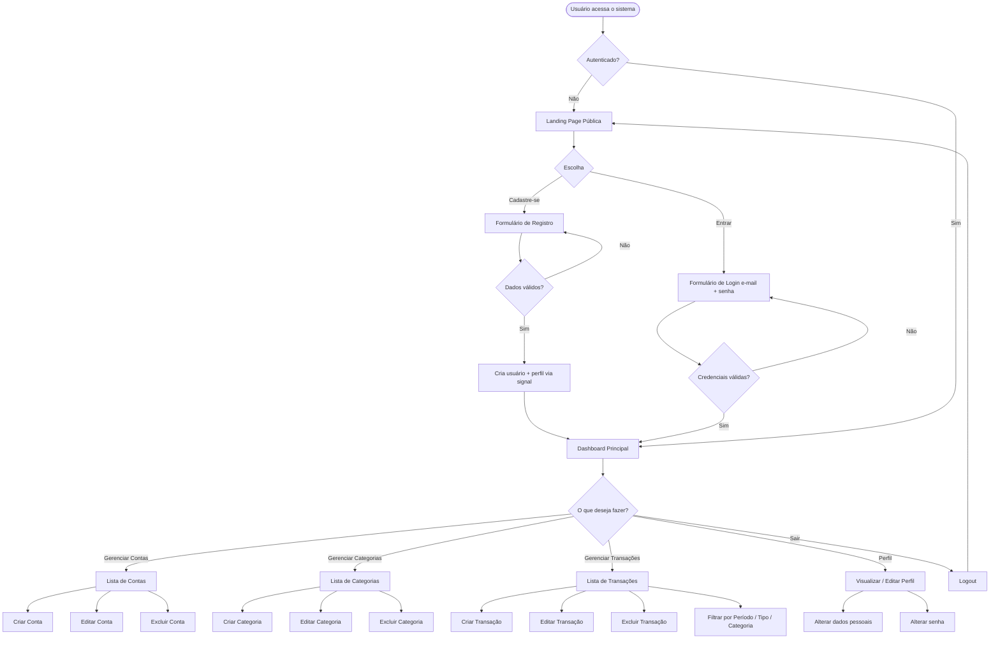
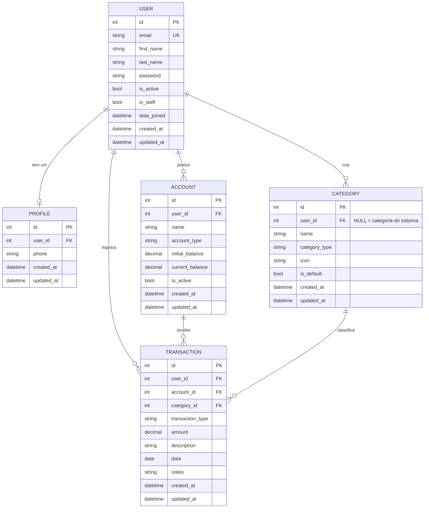
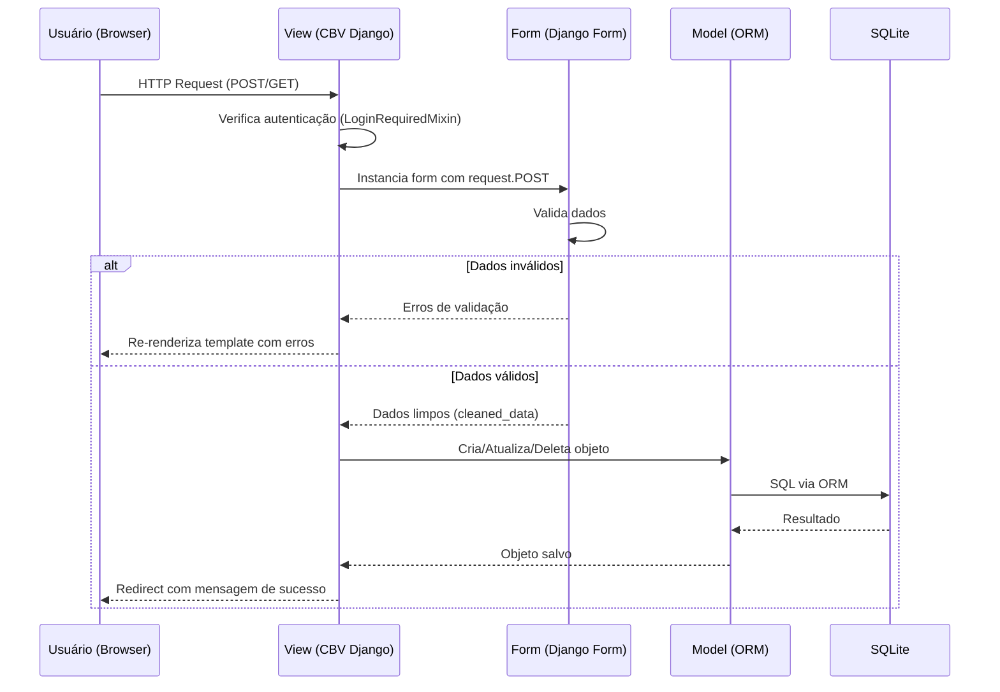

# Finanpy — Product Requirements Document (PRD)

> **Versão:** 1.0.0 · **Status:** Aprovado para Desenvolvimento · **Data:** 2026-07-15

---

## 1. Visão Geral

**Finanpy** é um sistema web de gestão de finanças pessoais desenvolvido com
Python e Django (full stack), com interface moderna, responsiva e em português
brasileiro. O sistema permite que usuários registrem e acompanhem suas
movimentações financeiras — receitas, despesas e transferências — organizadas
por categorias e contas bancárias.

O projeto segue uma filosofia de **simplicidade e coesão**: sem over-engineering,
sem dependências desnecessárias, usando ao máximo os recursos nativos do Django
e SQLite como banco de dados.

---

## 2. Sobre o Produto

| Atributo          | Valor                                            |
|-------------------|--------------------------------------------------|
| **Nome**          | Finanpy                                          |
| **Tipo**          | Aplicação Web (Django Full Stack)                |
| **Frontend**      | Django Template Language + TailwindCSS           |
| **Backend**       | Python + Django                                  |
| **Banco de Dados**| SQLite (padrão Django)                           |
| **Autenticação**  | Sistema nativo Django (login via e-mail)         |
| **Idioma da UI**  | Português Brasileiro                             |
| **Idioma do código** | Inglês                                        |
| **Estilo de código** | PEP 8, aspas simples, Class-Based Views       |

---

## 3. Propósito

Oferecer uma ferramenta **simples, visualmente agradável e funcional** para que
pessoas físicas possam:

- Registrar suas receitas e despesas do dia a dia.
- Organizar movimentações por categorias e contas bancárias.
- Ter uma visão clara do seu saldo e fluxo de caixa mensal.
- Tomar decisões financeiras mais conscientes com base em dados históricos.

O Finanpy não pretende ser um ERP financeiro. Seu diferencial é a **leveza,
clareza e facilidade de uso**.

---

## 4. Público-Alvo

| Perfil              | Descrição                                                      |
|---------------------|----------------------------------------------------------------|
| **Primário**        | Pessoas físicas que querem controlar gastos pessoais           |
| **Secundário**      | Freelancers e autônomos com renda variável                     |
| **Terciário**       | Desenvolvedores que querem estudar Django full stack na prática|

**Características comuns do usuário:**
- Usa smartphone e computador.
- Não é necessariamente técnico.
- Quer simplicidade: registro rápido e visualização clara.
- Valoriza design limpo e moderno.

---

## 5. Objetivos

### 5.1 Objetivos de Produto

- Entregar um MVP funcional com autenticação, contas, categorias e transações.
- Interface com design system consistente em todas as telas.
- Sistema 100% operacional com Django nativo + SQLite, sem dependências externas complexas.

### 5.2 Objetivos de Negócio

- Ser uma base de código de referência para sistemas Django full stack.
- Estar pronto para escalonamento futuro (PostgreSQL, Docker, API REST).

### 5.3 Objetivos Técnicos

- Separação clara de responsabilidades via apps Django.
- Código limpo, em inglês, seguindo PEP 8.
- Zero dívida técnica estrutural no MVP.

---

## 6. Requisitos Funcionais

### 6.1 Módulo: Site Público (Landing Page)

| ID     | Requisito                                                           | Prioridade |
|--------|---------------------------------------------------------------------|------------|
| RF-001 | Página inicial pública de apresentação do sistema                   | Must Have  |
| RF-002 | Botão "Cadastre-se" na landing page                                 | Must Have  |
| RF-003 | Botão "Entrar" na landing page                                      | Must Have  |

### 6.2 Módulo: Autenticação (users)

| ID     | Requisito                                                           | Prioridade |
|--------|---------------------------------------------------------------------|------------|
| RF-010 | Cadastro de novo usuário com e-mail, nome e senha                   | Must Have  |
| RF-011 | Login com e-mail e senha (não username)                             | Must Have  |
| RF-012 | Logout                                                              | Must Have  |
| RF-013 | Validação de e-mail único no cadastro                               | Must Have  |
| RF-014 | Validação de força de senha (mínimo 8 caracteres)                   | Must Have  |
| RF-015 | Redirecionamento para dashboard após login bem-sucedido             | Must Have  |
| RF-016 | Proteção de rotas autenticadas (redirect para login se não logado)  | Must Have  |

### 6.3 Módulo: Perfil (profiles)

| ID     | Requisito                                                           | Prioridade |
|--------|---------------------------------------------------------------------|------------|
| RF-020 | Criação automática de perfil ao registrar usuário (via signal)      | Must Have  |
| RF-021 | Visualização e edição de dados do perfil (nome, e-mail)             | Must Have  |
| RF-022 | Alteração de senha                                                  | Must Have  |

### 6.4 Módulo: Contas Bancárias (accounts)

| ID     | Requisito                                                           | Prioridade |
|--------|---------------------------------------------------------------------|------------|
| RF-030 | Listar contas do usuário autenticado                                | Must Have  |
| RF-031 | Criar nova conta (nome, tipo, saldo inicial)                        | Must Have  |
| RF-032 | Editar conta existente                                              | Must Have  |
| RF-033 | Excluir conta (somente se sem transações vinculadas)                | Must Have  |
| RF-034 | Exibir saldo atual calculado de cada conta                          | Must Have  |
| RF-035 | Tipos de conta: Corrente, Poupança, Carteira, Investimento          | Must Have  |

### 6.5 Módulo: Categorias (categories)

| ID     | Requisito                                                           | Prioridade |
|--------|---------------------------------------------------------------------|------------|
| RF-040 | Categorias padrão do sistema (pré-cadastradas via fixture/migration)| Must Have  |
| RF-041 | Listar categorias do usuário + categorias padrão                    | Must Have  |
| RF-042 | Criar categoria personalizada (nome, tipo: receita/despesa, ícone)  | Must Have  |
| RF-043 | Editar categoria personalizada                                      | Must Have  |
| RF-044 | Excluir categoria personalizada (somente sem transações vinculadas) | Must Have  |

### 6.6 Módulo: Transações (transactions)

| ID     | Requisito                                                           | Prioridade |
|--------|---------------------------------------------------------------------|------------|
| RF-050 | Listar transações do usuário com filtro por mês/ano atual           | Must Have  |
| RF-051 | Registrar transação do tipo Receita                                 | Must Have  |
| RF-052 | Registrar transação do tipo Despesa                                 | Must Have  |
| RF-053 | Campos da transação: descrição, valor, data, conta, categoria, tipo | Must Have  |
| RF-054 | Editar transação existente                                          | Must Have  |
| RF-055 | Excluir transação                                                   | Must Have  |
| RF-056 | Filtrar transações por: mês, tipo (receita/despesa), categoria      | Must Have  |
| RF-057 | Exibir total de receitas, total de despesas e saldo do período      | Must Have  |

### 6.7 Módulo: Dashboard

| ID     | Requisito                                                           | Prioridade |
|--------|---------------------------------------------------------------------|------------|
| RF-060 | Dashboard pós-login com resumo financeiro do mês atual              | Must Have  |
| RF-061 | Cards com: Total de Receitas, Total de Despesas, Saldo do mês       | Must Have  |
| RF-062 | Lista das 5 últimas transações                                      | Must Have  |
| RF-063 | Lista de contas com seus saldos                                     | Must Have  |

---

### 6.8 Fluxograma de UX



---

## 7. Requisitos Não-Funcionais

| ID      | Categoria          | Requisito                                                                        |
|---------|--------------------|----------------------------------------------------------------------------------|
| RNF-001 | **Segurança**      | Senhas armazenadas com hashing PBKDF2 (padrão Django)                            |
| RNF-002 | **Segurança**      | CSRF protection em todos os formulários (middleware padrão Django)               |
| RNF-003 | **Segurança**      | Rotas autenticadas protegidas com `LoginRequiredMixin`                           |
| RNF-004 | **Segurança**      | Dados de um usuário jamais acessíveis por outro (FK obrigatória em todos os models) |
| RNF-005 | **Performance**    | Listagem de transações com tempo de resposta < 500ms para até 5.000 registros   |
| RNF-006 | **Performance**    | Índices de banco nos campos `user`, `date` e `type` em transactions             |
| RNF-007 | **Usabilidade**    | Interface 100% responsiva (mobile-first com TailwindCSS)                        |
| RNF-008 | **Manutenibilidade**| Código em inglês, PEP 8, aspas simples, sem lógica de negócio em templates     |
| RNF-009 | **Escalabilidade** | Banco substituível de SQLite para PostgreSQL sem mudança de código de aplicação |
| RNF-010 | **Simplicidade**   | Sem over-engineering: sem Celery, Redis, DRF ou libs desnecessárias no MVP      |
| RNF-011 | **Consistência**   | Design system único aplicado em 100% das telas via template base                |
| RNF-012 | **Internacionalização** | Toda UI em português brasileiro; código-fonte em inglês                   |

---

## 8. Arquitetura Técnica

### 8.1 Stack

| Camada           | Tecnologia                                  |
|------------------|---------------------------------------------|
| Linguagem        | Python 3.12+                                |
| Framework Web    | Django 6.x                                  |
| Template Engine  | Django Template Language (DTL)              |
| CSS Framework    | TailwindCSS (via CDN no desenvolvimento)    |
| Banco de Dados   | SQLite (padrão Django)                      |
| Autenticação     | Django Auth nativo (customizado para e-mail)|
| ORM              | Django ORM                                  |
| Views            | Class-Based Views (CBV) preferencialmente   |
| Signals          | Django Signals (arquivo `signals.py` por app)|

### 8.2 Estrutura de Diretórios

```
finanpy/
├── accounts/           # Contas bancárias do usuário
│   ├── migrations/
│   ├── __init__.py
│   ├── admin.py
│   ├── apps.py
│   ├── models.py
│   ├── views.py
│   ├── urls.py
│   ├── forms.py
│   └── templates/
│       └── accounts/
├── categories/         # Categorias de transações
│   ├── migrations/
│   ├── __init__.py
│   ├── admin.py
│   ├── apps.py
│   ├── models.py
│   ├── views.py
│   ├── urls.py
│   ├── forms.py
│   └── templates/
│       └── categories/
├── core/               # Configurações globais
│   ├── __init__.py
│   ├── asgi.py
│   ├── settings.py
│   ├── urls.py
│   └── wsgi.py
├── profiles/           # Perfil de usuário
│   ├── migrations/
│   ├── __init__.py
│   ├── admin.py
│   ├── apps.py
│   ├── models.py
│   ├── signals.py      # Signal post_save para criar perfil
│   ├── views.py
│   ├── urls.py
│   ├── forms.py
│   └── templates/
│       └── profiles/
├── transactions/       # Transações financeiras
│   ├── migrations/
│   ├── __init__.py
│   ├── admin.py
│   ├── apps.py
│   ├── models.py
│   ├── views.py
│   ├── urls.py
│   ├── forms.py
│   └── templates/
│       └── transactions/
├── users/              # Modelo de usuário customizado
│   ├── migrations/
│   ├── __init__.py
│   ├── admin.py
│   ├── apps.py
│   ├── backends.py     # Backend de autenticação por e-mail
│   ├── models.py
│   ├── views.py
│   ├── urls.py
│   ├── forms.py
│   └── templates/
│       └── users/
├── templates/          # Templates globais e base
│   ├── base.html
│   ├── dashboard.html
│   └── landing.html
├── static/             # Arquivos estáticos globais
├── db.sqlite3
├── manage.py
├── requirements.txt
└── prd.md
```

### 8.3 Estrutura de Dados — Schemas (Mermaid ERD)



### 8.4 Fluxo de Dados por Request



---

## 9. Design System

### 9.1 Visão Geral

Design **dark mode** com gradientes vibrantes, tipografia moderna e componentes
consistentes em todas as telas. Implementado 100% com TailwindCSS dentro do
Django Template Language.

### 9.2 Paleta de Cores

| Papel               | Token TailwindCSS             | Hex        | Uso                                  |
|---------------------|-------------------------------|------------|--------------------------------------|
| **Fundo Principal** | `bg-gray-950`                 | `#030712`  | Fundo global da aplicação            |
| **Fundo Card**      | `bg-gray-900`                 | `#111827`  | Cards, painéis, formulários          |
| **Fundo Elevado**   | `bg-gray-800`                 | `#1f2937`  | Inputs, tabelas, hover states        |
| **Borda**           | `border-gray-700`             | `#374151`  | Bordas de cards, inputs              |
| **Primária**        | `from-violet-600 to-indigo-600` | Gradiente | Botões primários, acentos            |
| **Primária hover**  | `from-violet-500 to-indigo-500` | Gradiente | Estado hover do primário             |
| **Receita**         | `text-emerald-400`            | `#34d399`  | Valores positivos, receitas          |
| **Despesa**         | `text-rose-400`               | `#fb7185`  | Valores negativos, despesas          |
| **Neutro**          | `text-gray-400`               | `#9ca3af`  | Textos secundários, labels           |
| **Texto Principal** | `text-white`                  | `#ffffff`  | Títulos, valores principais          |
| **Texto Secundário**| `text-gray-300`               | `#d1d5db`  | Textos de apoio                      |
| **Destaque/Accent** | `text-violet-400`             | `#a78bfa`  | Links, ícones de destaque            |

### 9.3 Tipografia

```html
<!-- Fonte via Google Fonts no base.html -->
<link href="https://fonts.googleapis.com/css2?family=Inter:wght@300;400;500;600;700&display=swap" rel="stylesheet">

<!-- Aplicação no body -->
<body class="font-['Inter'] bg-gray-950 text-white antialiased">
```

| Elemento          | Classes TailwindCSS                              |
|-------------------|--------------------------------------------------|
| H1 (Página)       | `text-3xl font-bold text-white`                  |
| H2 (Seção)        | `text-xl font-semibold text-white`               |
| H3 (Card)         | `text-lg font-medium text-gray-100`              |
| Texto corpo       | `text-sm text-gray-300`                          |
| Label de form     | `text-sm font-medium text-gray-400`              |
| Valor monetário   | `text-2xl font-bold tabular-nums`                |
| Badge / Tag       | `text-xs font-medium`                            |

### 9.4 Gradiente de Fundo (Header e Landing)

```html
<!-- Fundo com gradiente para seções de destaque -->
<div class="bg-gradient-to-br from-gray-950 via-gray-900 to-violet-950">

<!-- Gradiente no logo/brand -->
<span class="bg-gradient-to-r from-violet-400 to-indigo-400 bg-clip-text text-transparent font-bold text-2xl">
    Finanpy
</span>
```

### 9.5 Botões

```html
<!-- Botão Primário -->
<button class="w-full bg-gradient-to-r from-violet-600 to-indigo-600
               hover:from-violet-500 hover:to-indigo-500
               text-white font-semibold py-2.5 px-6 rounded-lg
               transition-all duration-200 ease-in-out
               focus:outline-none focus:ring-2 focus:ring-violet-500 focus:ring-offset-2 focus:ring-offset-gray-900
               disabled:opacity-50 disabled:cursor-not-allowed">
    Salvar
</button>

<!-- Botão Secundário / Outline -->
<button class="border border-gray-600 hover:border-gray-500
               text-gray-300 hover:text-white
               font-medium py-2.5 px-6 rounded-lg
               transition-all duration-200
               hover:bg-gray-800">
    Cancelar
</button>

<!-- Botão de Perigo (excluir) -->
<button class="bg-rose-600 hover:bg-rose-500
               text-white font-medium py-2 px-4 rounded-lg
               transition-colors duration-200">
    Excluir
</button>

<!-- Botão Ícone -->
<button class="p-2 rounded-lg text-gray-400 hover:text-white hover:bg-gray-700
               transition-colors duration-200">
    <!-- ícone SVG aqui -->
</button>
```

### 9.6 Inputs e Formulários

```html
<!-- Estrutura de campo de formulário -->
<div class="space-y-1">
    <label for="email" class="block text-sm font-medium text-gray-400">
        E-mail
    </label>
    <input
        type="email"
        id="email"
        name="email"
        class="w-full bg-gray-800 border border-gray-700
               text-white placeholder-gray-500
               rounded-lg px-4 py-2.5
               focus:outline-none focus:ring-2 focus:ring-violet-500 focus:border-transparent
               transition-all duration-200"
        placeholder="seu@email.com"
    >
    <!-- Mensagem de erro -->
    <p class="text-xs text-rose-400">Campo obrigatório.</p>
</div>

<!-- Select -->
<select class="w-full bg-gray-800 border border-gray-700
               text-white rounded-lg px-4 py-2.5
               focus:outline-none focus:ring-2 focus:ring-violet-500 focus:border-transparent">
    <option>Selecione...</option>
</select>

<!-- Textarea -->
<textarea class="w-full bg-gray-800 border border-gray-700
                 text-white placeholder-gray-500
                 rounded-lg px-4 py-2.5 resize-none
                 focus:outline-none focus:ring-2 focus:ring-violet-500 focus:border-transparent"
          rows="3"></textarea>
```

### 9.7 Cards

```html
<!-- Card padrão -->
<div class="bg-gray-900 border border-gray-800 rounded-xl p-6
            hover:border-gray-700 transition-colors duration-200">
    <!-- conteúdo -->
</div>

<!-- Card de métrica (Dashboard) -->
<div class="bg-gray-900 border border-gray-800 rounded-xl p-6">
    <div class="flex items-center justify-between mb-2">
        <span class="text-sm text-gray-400">Total de Receitas</span>
        <span class="p-2 bg-emerald-500/10 rounded-lg text-emerald-400">
            <!-- ícone -->
        </span>
    </div>
    <p class="text-2xl font-bold text-emerald-400 tabular-nums">R$ 5.200,00</p>
    <p class="text-xs text-gray-500 mt-1">Mês atual</p>
</div>
```

### 9.8 Tabelas

```html
<div class="overflow-x-auto rounded-xl border border-gray-800">
    <table class="w-full text-sm">
        <thead class="bg-gray-800/50">
            <tr>
                <th class="text-left text-gray-400 font-medium px-6 py-4">Descrição</th>
                <th class="text-left text-gray-400 font-medium px-6 py-4">Data</th>
                <th class="text-right text-gray-400 font-medium px-6 py-4">Valor</th>
            </tr>
        </thead>
        <tbody class="divide-y divide-gray-800">
            <tr class="hover:bg-gray-800/30 transition-colors duration-150">
                <td class="px-6 py-4 text-gray-200">Mercado</td>
                <td class="px-6 py-4 text-gray-400">15/07/2026</td>
                <td class="px-6 py-4 text-right font-semibold text-rose-400">- R$ 150,00</td>
            </tr>
        </tbody>
    </table>
</div>
```

### 9.9 Layout e Grid

```html
<!-- Layout principal pós-login -->
<div class="min-h-screen bg-gray-950 flex">
    <!-- Sidebar -->
    <aside class="w-64 bg-gray-900 border-r border-gray-800 flex flex-col">
        <!-- nav links -->
    </aside>
    <!-- Conteúdo principal -->
    <main class="flex-1 overflow-y-auto">
        <div class="p-8 max-w-7xl mx-auto">
            <!-- conteúdo da página -->
        </div>
    </main>
</div>

<!-- Grid de cards (Dashboard) -->
<div class="grid grid-cols-1 md:grid-cols-2 lg:grid-cols-3 gap-6">
    <!-- cards -->
</div>
```

### 9.10 Navegação (Sidebar)

```html
<aside class="w-64 bg-gray-900 border-r border-gray-800 flex flex-col min-h-screen">
    <!-- Logo -->
    <div class="px-6 py-5 border-b border-gray-800">
        <span class="bg-gradient-to-r from-violet-400 to-indigo-400
                     bg-clip-text text-transparent font-bold text-xl">
            Finanpy
        </span>
    </div>
    <!-- Links de navegação -->
    <nav class="flex-1 px-4 py-6 space-y-1">
        <a href=""
           class="flex items-center gap-3 px-4 py-2.5 rounded-lg
                  text-gray-400 hover:text-white hover:bg-gray-800
                  transition-colors duration-200
                  
                      bg-violet-600/20 text-violet-400 border border-violet-600/30
                  ">
            <!-- ícone + texto -->
            <span>Dashboard</span>
        </a>
    </nav>
    <!-- Footer da sidebar: usuário logado -->
    <div class="px-4 py-4 border-t border-gray-800">
        <div class="flex items-center gap-3">
            <div class="w-8 h-8 rounded-full bg-gradient-to-br from-violet-500 to-indigo-500
                        flex items-center justify-center text-white text-sm font-semibold">
                {{ request.user.first_name.0 }}
            </div>
            <div class="flex-1 min-w-0">
                <p class="text-sm font-medium text-white truncate">{{ request.user.get_full_name }}</p>
                <p class="text-xs text-gray-500 truncate">{{ request.user.email }}</p>
            </div>
        </div>
    </div>
</aside>
```

### 9.11 Alertas / Mensagens (Django Messages)

```html
<!-- Sucesso -->
<div class="bg-emerald-500/10 border border-emerald-500/30 text-emerald-400
            px-4 py-3 rounded-lg text-sm flex items-center gap-2">
    <!-- ícone check --> Operação realizada com sucesso!
</div>
<!-- Erro -->
<div class="bg-rose-500/10 border border-rose-500/30 text-rose-400
            px-4 py-3 rounded-lg text-sm flex items-center gap-2">
    <!-- ícone x --> Ocorreu um erro. Verifique os dados.
</div>
<!-- Aviso -->
<div class="bg-amber-500/10 border border-amber-500/30 text-amber-400
            px-4 py-3 rounded-lg text-sm">
    Atenção!
</div>
```

### 9.12 Badges de Tipo

```html
<!-- Receita -->
<span class="inline-flex items-center px-2.5 py-0.5 rounded-full text-xs font-medium
             bg-emerald-500/10 text-emerald-400 border border-emerald-500/20">
    Receita
</span>
<!-- Despesa -->
<span class="inline-flex items-center px-2.5 py-0.5 rounded-full text-xs font-medium
             bg-rose-500/10 text-rose-400 border border-rose-500/20">
    Despesa
</span>
```

---

## 10. User Stories

### Épico 1: Autenticação e Acesso

---

**US-001 — Registro de Conta**

> _Como_ visitante do sistema,
> _Quero_ criar uma conta com meu nome, e-mail e senha,
> _Para_ ter acesso ao sistema de gestão financeira.

**Critérios de Aceite:**
- [ ] Formulário de registro solicita: primeiro nome, sobrenome, e-mail e senha.
- [ ] E-mail deve ser único no sistema; exibir erro se já cadastrado.
- [ ] Senha deve ter no mínimo 8 caracteres.
- [ ] Após registro bem-sucedido, usuário é autenticado e redirecionado ao dashboard.
- [ ] Perfil é criado automaticamente via signal.

---

**US-002 — Login com E-mail**

> _Como_ usuário cadastrado,
> _Quero_ fazer login com meu e-mail e senha,
> _Para_ acessar meu painel financeiro.

**Critérios de Aceite:**
- [ ] Campo de login aceita e-mail (não username).
- [ ] Exibir mensagem de erro genérica para credenciais inválidas (não indicar qual campo está errado).
- [ ] Após login bem-sucedido, redirecionar para dashboard.
- [ ] Manter usuário logado via session (comportamento padrão Django).

---

**US-003 — Logout**

> _Como_ usuário autenticado,
> _Quero_ encerrar minha sessão,
> _Para_ proteger minha conta em dispositivos compartilhados.

**Critérios de Aceite:**
- [ ] Opção de logout disponível na sidebar.
- [ ] Após logout, redirecionar para landing page.
- [ ] Sessão é invalidada corretamente.

---

### Épico 2: Contas Bancárias

---

**US-010 — Criar Conta Bancária**

> _Como_ usuário autenticado,
> _Quero_ cadastrar minhas contas bancárias,
> _Para_ organizar minhas finanças por conta.

**Critérios de Aceite:**
- [ ] Formulário com: nome da conta, tipo (Corrente/Poupança/Carteira/Investimento), saldo inicial.
- [ ] Conta é criada vinculada ao usuário logado.
- [ ] Saldo inicial é registrado como saldo atual da conta.
- [ ] Exibir mensagem de sucesso após criação.

---

**US-011 — Listar e Visualizar Contas**

> _Como_ usuário autenticado,
> _Quero_ ver todas as minhas contas com seus saldos,
> _Para_ ter visibilidade consolidada dos meus recursos.

**Critérios de Aceite:**
- [ ] Listar somente contas do usuário logado.
- [ ] Exibir nome, tipo e saldo atual de cada conta.
- [ ] Exibir saldo total de todas as contas.

---

**US-012 — Editar e Excluir Conta**

> _Como_ usuário autenticado,
> _Quero_ editar ou excluir minhas contas,
> _Para_ manter meu cadastro atualizado.

**Critérios de Aceite:**
- [ ] Editar nome e tipo da conta.
- [ ] Excluir conta somente se não houver transações vinculadas.
- [ ] Exibir mensagem de erro se tentativa de exclusão com transações existentes.
- [ ] Confirmação antes de excluir.

---

### Épico 3: Categorias

---

**US-020 — Gerenciar Categorias**

> _Como_ usuário autenticado,
> _Quero_ criar, editar e excluir categorias personalizadas,
> _Para_ classificar minhas transações de forma personalizada.

**Critérios de Aceite:**
- [ ] Exibir categorias padrão do sistema (somente leitura) e categorias do usuário.
- [ ] Criar categoria com: nome, tipo (receita/despesa) e ícone (emoji ou texto).
- [ ] Editar somente categorias do próprio usuário.
- [ ] Excluir somente categorias sem transações vinculadas.

---

### Épico 4: Transações

---

**US-030 — Registrar Transação**

> _Como_ usuário autenticado,
> _Quero_ registrar receitas e despesas,
> _Para_ manter meu histórico financeiro atualizado.

**Critérios de Aceite:**
- [ ] Formulário com: tipo (receita/despesa), descrição, valor, data, conta, categoria.
- [ ] Valor deve ser positivo e maior que zero.
- [ ] Ao salvar, atualizar saldo da conta correspondente.
- [ ] Somente contas e categorias do próprio usuário (ou padrão) são exibidas.

---

**US-031 — Listar e Filtrar Transações**

> _Como_ usuário autenticado,
> _Quero_ ver meu histórico de transações com filtros,
> _Para_ analisar meu fluxo financeiro por período e categoria.

**Critérios de Aceite:**
- [ ] Listar transações do mês atual por padrão.
- [ ] Filtrar por: mês/ano, tipo (receita/despesa), categoria.
- [ ] Exibir total de receitas, despesas e saldo do período filtrado.
- [ ] Somente transações do usuário logado.

---

**US-032 — Editar e Excluir Transação**

> _Como_ usuário autenticado,
> _Quero_ corrigir ou remover transações,
> _Para_ manter meu histórico financeiro correto.

**Critérios de Aceite:**
- [ ] Editar todos os campos da transação.
- [ ] Ao editar valor ou conta, recalcular saldo das contas afetadas.
- [ ] Ao excluir, reverter o impacto no saldo da conta.
- [ ] Confirmação antes de excluir.

---

### Épico 5: Dashboard e Perfil

---

**US-040 — Dashboard Financeiro**

> _Como_ usuário autenticado,
> _Quero_ ver um resumo financeiro ao entrar no sistema,
> _Para_ ter uma visão rápida da minha situação financeira atual.

**Critérios de Aceite:**
- [ ] Cards com: total de receitas do mês, total de despesas do mês, saldo do mês.
- [ ] Lista das 5 últimas transações registradas.
- [ ] Lista de contas com seus saldos atuais.

---

**US-050 — Gerenciar Perfil**

> _Como_ usuário autenticado,
> _Quero_ visualizar e editar meus dados e alterar minha senha,
> _Para_ manter meu cadastro atualizado.

**Critérios de Aceite:**
- [ ] Exibir nome, e-mail do usuário logado.
- [ ] Editar primeiro nome e sobrenome.
- [ ] Alterar senha com validação de senha atual + confirmação.

---

## 11. Métricas de Sucesso

### 11.1 KPIs de Produto

| KPI                              | Meta MVP        | Observação                              |
|----------------------------------|-----------------|-----------------------------------------|
| Funcionalidades entregues        | 100% do escopo  | Todos os RF-Must Have implementados     |
| Cobertura do design system       | 100% das telas  | Nenhuma tela sem o template base        |
| Zero erros 500 em fluxos críticos| 0 erros         | Registro, login, CRUD de transações     |
| Tempo de resposta (listagens)    | < 500ms         | Para bases de até 5.000 registros       |
| Responsividade mobile            | 100% das telas  | Testado em viewport 375px               |

### 11.2 KPIs de Qualidade de Código

| KPI                              | Meta            |
|----------------------------------|-----------------|
| Conformidade PEP 8               | 100%            |
| Uso de CBVs                      | > 90% das views |
| Sem lógica de negócio em templates | 100%          |
| Isolamento de dados por usuário  | 100% das queries|

### 11.3 KPIs de Experiência do Usuário

| KPI                              | Meta            |
|----------------------------------|-----------------|
| Fluxo de registro completo       | ≤ 3 cliques     |
| Registro de nova transação       | ≤ 4 campos obrigatórios |
| Feedback visual em todas as ações| 100% (mensagens Django Messages) |
| Interface em português correto   | 100%            |

---

## 12. Riscos e Mitigações

| Risco                                                    | Probabilidade | Impacto   | Mitigação                                                                      |
|----------------------------------------------------------|---------------|-----------|--------------------------------------------------------------------------------|
| Não usar `CustomUser` desde o início                     | Alta          | Crítico   | ⚠️ Configurar `AUTH_USER_MODEL` ANTES da primeira migration                    |
| `SECRET_KEY` exposta no `settings.py`                    | Alta (já ocorreu) | Alto  | Mover para `.env` via `python-decouple` ou variável de ambiente                |
| Saldo de conta fora de sincronia com transações          | Média         | Alto      | Recalcular saldo via method no model ou signal; nunca armazenar saldo sem transação |
| TailwindCSS via CDN pode ter classes purged em produção  | Baixa (CDN não purga) | Médio | Usar CDN Play no desenvolvimento; configurar build para produção na Sprint 5  |
| Queries N+1 na listagem de transações                    | Média         | Médio     | Usar `select_related('account', 'category')` nas views                        |
| Acesso cruzado de dados entre usuários                   | Baixa         | Crítico   | Sempre filtrar por `user=request.user` em TODAS as queries                    |
| Escopo crescente (feature creep)                         | Alta          | Médio     | Seguir PRD rigorosamente; nada além do documentado no MVP                     |
| SQLite com múltiplos acessos simultâneos em produção     | Média         | Alto      | Aviso explícito: SQLite é para desenvolvimento; PostgreSQL na Sprint 5         |

*PRD gerado por análise arquitetural em 2026-07-15 · Finanpy v1.0.0*
